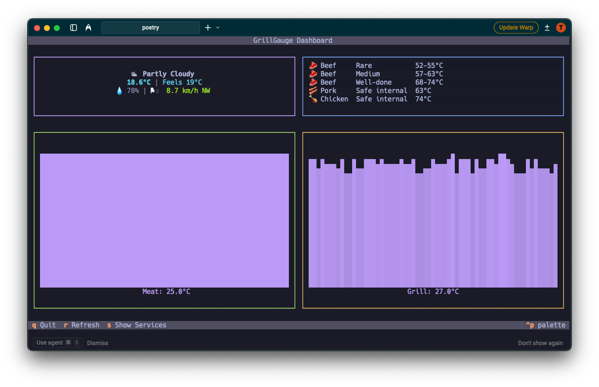

# grillgauge

A CLI tool for monitoring BLE meat probes with support for grillprobeE devices. Designed to run on Raspberry Pi with automated deployment via Ansible.



## Why?

I have one of this:


The probe is fantastic but the app is not. Also, I didn't want to be glued to my phone while monitoring temperatures. I needed a way to monitor an oven without constantly checking my device.

## Features

- **Real-time Temperature Monitoring**: Track meat and grill probe temperatures with sparkline visualizations
- **Terminal Dashboard**: Beautiful TUI dashboard using Textual with live weather, cooking guidelines, and temperature trends
- **Automatic Device Detection**: grillprobeE device discovery and configuration on service startup
- **Prometheus Integration**: Metrics server for monitoring and alerting
- **Weather Integration**: Auto-location weather data via Open-Meteo API
- **Ansible Deployment**: Automated deployment to Raspberry Pi with systemd service management
- **Resource Monitoring**: Track CPU, memory, and uptime for all services
- **Bluetooth Stack**: Complete BlueZ configuration with automated pairing
- **Fault Tolerance**: Maintains last known good values during temporary connection failures

## Quick Start

### For Development (Local Testing)

1. Ensure you have Poetry installed: `curl -sSL https://install.python-poetry.org | python3 -`
2. Clone the project and install dependencies: `poetry install`

### Usage

```bash
poetry run grillgauge --help
```

#### Scanning for Devices

```bash
poetry run grillgauge scan --timeout 10
```

This scans for grillprobeE devices and automatically configures them when found. The tool will show progress and register compatible devices.

#### Example Output
```
INFO Scanning for grillprobeE devices...
INFO Found 1 potential grillprobeE devices
INFO Processing device: 7999C07F-3D73-E8F8-9D5A-AE8DCD4DDEFC
INFO Device name: BBQ ProbeE 26012
INFO Meat temp: 28.0°C, Grill temp: 31.0°C
INFO Successfully registered: BBQ ProbeE 26012
```

#### Work on the dashboard

The dashboard needs the prometheus service to gather data. Check [Raspberry Pi Deployment](#quick-start).

To do local development you can set the PROMETHEUS_URL env var to the pi and `PROMETHEUS_URL="http://grillgauge:9090" poetry run grillgauge dashboard`

### Raspberry Pi Deployment

1. **Prerequisites**:
   - Raspberry Pi running OS Lite 64-bit recommended. This was tested on `Linux grillgauge 6.12.47+rpt-rpi-v8 #1 SMP PREEMPT Debian 1:6.12.47-1+rpt1 (2025-09-16) aarch64 GNU/Linux` using a `raspberry pi 4` and a `raspberry pi zero 2 W`
   - Use [raspberry pi imager](https://www.raspberrypi.com/software/) to burn the sd card. It's the most straight forward way to set wifi, public keys, hostname, etc.
   - [Ahoy](https://github.com/ahoy-cli/ahoy) installed on your local machine

2. **Setup SSH access**:
   ```bash
   # Copy your SSH key to the Raspberry Pi
   ssh-copy-id <raspberry-pi-user>@<raspberry-pi-ip>
   ```

3. **Configure production inventory**:
   ```bash
   ahoy provision setup
   ```
   This interactive wizard will generate your production inventory file with your Raspberry Pi's connection details.

4. **Deploy to Raspberry Pi**:
   ```bash
   ahoy provision deploy
   ```
   This will run the ansible provisioning on the pi.

5. **Verify deployment**:
   ```bash
   ahoy provision status
   ```


### Prometheus Metrics Server

```bash
# Secure default (localhost only)
poetry run grillgauge serve --port 8000

# Allow access from other machines on the network
poetry run grillgauge serve --host 0.0.0.0 --port 8000
```

Starts an HTTP server that exposes grillprobeE temperature metrics for Prometheus monitoring. The server continuously polls temperatures from all configured probes every 10 seconds and serves metrics at `/metrics`.

**Note:** Device discovery runs once on service startup. To discover new devices, restart the service.

#### Network Configuration

**Development/Manual Use:**
- Default: `--host 127.0.0.1` (localhost only, secure)
- Network access: `--host 0.0.0.0` (all interfaces)

**Production Deployment (Raspberry Pi):**
- Configured via Ansible to bind to `0.0.0.0` by default
- This allows Prometheus to scrape metrics from other machines on the network
- Customize in `ansible/inventory/production.ini`:
  ```ini
  grillgauge_server_host=0.0.0.0  # Network-wide access
  grillgauge_server_port=8000     # Metrics port
  ```

**Security Note**: By default, the CLI binds to `127.0.0.1` (localhost only) for security. Production deployments via Ansible bind to `0.0.0.0` to allow Prometheus to scrape metrics from other machines on your network.

#### Metrics Endpoints

- `/metrics` - Prometheus metrics output
- `/health` - Health check endpoint

#### Example Metrics Output

```
# HELP grillgauge_meat_temperature_celsius Meat probe temperature in Celsius
# TYPE grillgauge_meat_temperature_celsius gauge
grillgauge_meat_temperature_celsius{device_address="AA:BB:CC:DD:EE:FF",probe_name="bbq-probee-26012"} 65.5

# HELP grillgauge_grill_temperature_celsius Grill temperature in Celsius
# TYPE grillgauge_grill_temperature_celsius gauge
grillgauge_grill_temperature_celsius{device_address="AA:BB:CC:DD:EE:FF",probe_name="bbq-probee-26012"} 225.0

# HELP grillgauge_probe_status Probe connectivity status (1=online, 0=offline)
# TYPE grillgauge_probe_status gauge
grillgauge_probe_status{device_address="AA:BB:CC:DD:EE:FF",probe_name="bbq-probee-26012"} 1
```

#### Fault Tolerance

The metrics server maintains last known good temperature values during BLE connection failures, ensuring stable monitoring data even when probes temporarily disconnect.

### Device Configuration

Configured devices are saved to `.env`:

```
PROBE_MACS=7999C07F-3D73-E8F8-9D5A-AE8DCD4DDEFC
PROBE_NAMES=BBQ ProbeE 26012
PROBE_LAST_SEEN=2025-01-09T12:34:56.789012+00:00
```

## Compatibility

Designed specifically for FMG SH253B grillprobeE thermometers.

## Discovery vs Monitoring

GrillGauge uses two separate processes:

### Device Discovery (One-Time on Startup)
- Runs automatically when the `grillgauge` service starts
- Scans for new BLE devices and registers them to `.env`
- Takes approximately 10-20 seconds to complete
- **To discover new devices**: Restart the service with `sudo systemctl restart grillgauge`

### Temperature Monitoring (Continuous)
- Polls temperatures from all configured probes every 10 seconds
- Publishes metrics to Prometheus endpoint at `/metrics`
- Runs continuously in the background after discovery completes
- Maintains last known good values during temporary connection failures

**Note**: Device discovery is intentionally separated from temperature monitoring to avoid BLE conflicts and ensure stable operation.

## Deployment Architecture

GrillGauge is deployed to Raspberry Pi using Ansible and runs as systemd services:

### Systemd Services

1. **grillgauge.service** - Main metrics server
   - Runs `grillgauge serve` on port 8000
   - Exposes Prometheus metrics at `/metrics`
   - Auto-starts on boot
   - Performs one-time device discovery on startup

2. **prometheus.service** - Metrics collection and storage
   - Scrapes metrics from grillgauge service
   - Provides query API for dashboard
   - Web UI available on port 9090
   - Auto-starts on boot

### Ansible Provisioning

The deployment uses Ansible roles:

- **bluetooth** - Installs and configures BlueZ Bluetooth stack with automated pairing
- **grillgauge** - Deploys application and systemd services
- **prometheus** - Prometheus server setup for metrics collection and querying

#### Ahoy Commands

```bash
# Setup production Raspberry Pi inventory (first time)
ahoy provision setup

# Test Ansible playbooks in Docker container
ahoy provision test

# Deploy to production Raspberry Pi
ahoy provision deploy

# Check service status on Raspberry Pi
ahoy provision status

# Show Python package versions
ahoy provision freeze
```

#### Configuration

The grillgauge service is configured via environment variables in `/opt/grillgauge/.env`. Device discovery runs automatically once on service startup.

### Monitoring on Raspberry Pi

```bash
# View metrics server logs
journalctl -u grillgauge -f

# Check service status
systemctl status grillgauge

# Restart service (triggers device discovery)
sudo systemctl restart grillgauge

# Check Bluetooth status
systemctl status bluetooth
```

## Development

### Running Tests
```bash
# Run all tests
poetry run pytest

# Run with coverage
poetry run pytest --cov=grillgauge
```

### Code Quality
Uses Ruff for linting and formatting, Pytest for testing, and Poetry for dependency management.

## Technology Stack

### Application
- **Python 3.13** - Core application language
- **Bleak** - Cross-platform BLE library for device communication
- **aiohttp** - Async HTTP server for Prometheus metrics
- **prometheus_client** - Metrics exposition
- **coloredlogs** - Enhanced logging output

### Dashboard & Monitoring
- **Textual** - Python TUI framework for terminal applications
- **httpx** - HTTP client for fetching weather and service data
- **Open-Meteo API** - Free weather data (no API key required)
- **Prometheus** - Metrics storage and querying

### Infrastructure
- **Raspberry Pi OS (64-bit)** - Production runtime environment
- **BlueZ** - Linux Bluetooth protocol stack
- **systemd** - Service management and auto-start
- **Ansible** - Infrastructure as code, automated provisioning
- **Ahoy** - Task runner for deployment commands

### Development Tools
- **Poetry** - Dependency management and packaging
- **Ruff** - Fast Python linter and formatter
- **Pytest** - Testing framework
- **Docker** - Ansible playbook testing environment
